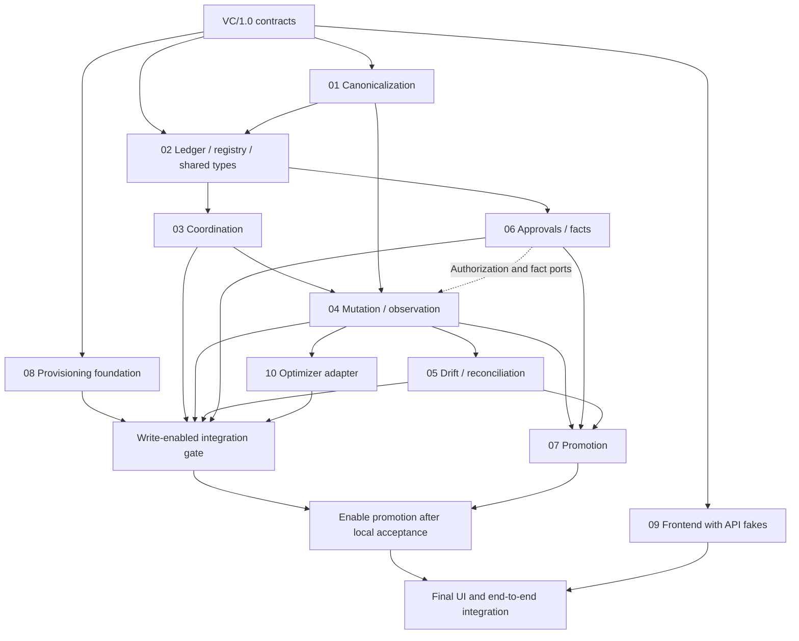

# Implementation plan: Genie version control and promotion

Plan contract: **VC/1.0** · Prepared: **2026-09-06** · Repository: `databricks-genie-workbench`, branch `version-control-cicd`.

This is an implementation plan, not an implementation or a rewrite of the design. Authority is the supplied `_review_README.md` and `_review_ADR.md`, destined for `docs/design/version_control/README.md` and `ADR-001-api-observed-versioning.md`. The supplied repository map defines existing locations; new paths below are proposed. Verify concrete symbols and package internals before editing.

## Protocol interpretation

- Use the detailed README admission section and ADR decision 8: **reserve without write authority → commit immutable evidence → one admission CAS binding that evidence → PATCH**. Residual “one Delta commit” shorthand does not mean a cross-table transaction.
- Assume **no usable conditional update in v1**. Preserve the two-PATCH protocol; do not depend on preview ETag/combined-update behavior or assert that no such API can exist.
- At most one optimizer-origin champion version per run; external preimages and recovery observations are additional evidence, not iteration versions.
- Production read capture needs a trusted edit-capable reader, not elevated human viewers. Expiry never permits takeover. Without a verified request-lifetime bound, automatic quarantine clearance stays disabled.

## Modules and exclusive ownership

| ID | Plan | Exclusive primary responsibility | DDL ownership |
|---|---|---|---|
| M01 | [Canonicalization](module-01-canonicalization.md) | Existing `config_fingerprint.py`; canonical forms and semantic diff | None |
| M02 | [Ledger and registry](module-02-ledger-registry.md) | Versions, logical identity, physical/provisional binding, shared Python contract definitions | Versions, registry, snapshot Volume |
| M03 | [Coordination](module-03-coordination-admission.md) | Serializable CAS, durable claim lifecycle, quarantine | Coordination |
| M04 | [Mutation and observation](module-04-mutation-observation.md) | Genie transport, existing create/edit/router integrations, observer, restore Job | None |
| M05 | [Drift and reconciliation](module-05-drift-reconciliation.md) | Three-head classification, reconcile actions and scheduled detection | None |
| M06 | [Approvals and audit](module-06-approvals-audit.md) | Approval/release/operation facts, authorization policy, audit | Operations, private approval evidence Volume |
| M07 | [Promotion](module-07-cross-workspace-promotion.md) | Packages, mappings, preflight, target-local pull execution, receipts | Outbound package and target receipt Volumes |
| M08 | [Provisioning and integration](module-08-provisioning-identity.md) | DAB machinery, grants, authentication adapters, root composition/build files | Executes owner-supplied DDL; does not author other modules' schemas |
| M09 | [Frontend](module-09-workbench-frontend.md) | All frontend integration, overview badges, VC/promotion tab | None |
| M10 | [Optimizer integration](module-10-optimizer-integration.md) | Optimizer package runtime and champion adapter; isolated candidates | None; existing telemetry unchanged |

Every existing shared file has one owner: `backend/main.py`, `backend/services/auth.py`, `backend/models.py`, `pyproject.toml`, `requirements.txt`, DAB manifests and deploy scripts → M08; `backend/routers/{create,spaces,auto_optimize}.py` and all create-flow mutation helpers → M04; `frontend/**` → M09; optimizer package excluding its DAB manifest → M10. Narrow exact manifests and exceptions are in each plan. Do not add unrelated files to an ownership glob.

## Dependency graph

Solid arrows are implementation prerequisites; dashed arrows are port-only dependencies that can be mocked. The graph is deliberately acyclic for concrete adapters; M03 never imports M06 implementation.

## Build order and release gates

1. **Freeze contracts.** M02 creates shared dataclasses/Protocols and golden wire fixtures from `contracts.md`; M08 creates empty composition/package scaffolding and explicit disabled feature switches. No runtime writer is enabled.
2. **Parallel foundation:** M01, M02 (using canonicalizer fake), M03 (ledger/facts fakes), M06 (coordination consumer fake), M08 infrastructure verification, M09 API-faked UI. M02 owns shared test fakes; individual modules own their test files.
3. **Observation-only checkpoint:** integrate M01/M02 plus M03's read-reservation/observed-head subset, M04 observer and M09 history. All four table definitions may be provisioned early to serialize observations safely; no PATCH/POST is enabled. Without coordination, history is read-only and marked stale; never “realign” via an unguarded observation writer.
4. **First write-enabled milestone:** integrate complete M03/M04, M05 baseline reconciliation/dual-authority detection, M06 local authorization and durable consumption, M08 fail-closed identity/grants/Jobs, M10 champion routing. M09 local history/restore/conflict UI lands here. Run every `FM-*` and `F-*` test in `testing-strategy.md` **before enabling writes**. Unsupported or unintegrated writers remain explicitly disabled, never on their legacy bypass.
5. **Parallel completion:** M05 advanced actions/notifications, M06 production approval policy, M10 telemetry drill-through, and M09 remaining views. M07 may develop offline rendering/transport mocks earlier, but target deployment is not enabled before local milestone acceptance.
6. **Promotion:** integrate M07 with target-side M06/M08, then M09 real promotion/receipt UI; run two-workspace and denied-principal tests. Hardening/recovery drills and green suites define completion, not a successful deploy alone.

## Parallel git-subtree strategy

These ownership sets span existing directories, so **do not pretend that `backend/` can be split into ten disjoint subtrees** and do not reorganize production code merely to fit git. Use subtree overlay repositories and one integration owner:

1. Integrator records the common application base SHA and VC/1.0. Create a small module overlay repository per module containing only its owned paths at their original repository-relative locations. Record the baseline overlay SHA and an `owned-paths` manifest outside the application deliverable. Read-only dependencies come from a separate full checkout at the frozen base.
2. Developers test by applying their overlay onto their own full scratch checkout. Only owned paths may enter their overlay commits; mocks replace unfinished dependencies. Do not use a shared writable checkout or edit `conftest.py`/root dependencies from module branches.
3. In a separate assembly repository, import overlays with actual `git subtree add --prefix=modules/module-NN <overlay-repo> <branch> --squash` and update using `git subtree pull` on the same prefix. Prefixes do not overlap. Keep this assembly repository outside the application repository.
4. Integrator exports the delta between each overlay's baseline and reviewed tip using `git diff <baseline> <tip> -- <owned-paths>` and applies that patch at the application root with `git apply --index`. Enforce the whitelist before applying, run the module tests and then contract tests. This preserves application import paths; subtree copies are never shipped into the app.
5. M08 alone integrates root composition/config/dependency changes requested by others; M04 alone edits legacy mutation adapters; M09 alone mounts frontend pages. Requests name the stable port and a contract test, not a shared-file patch.
6. Contract changes require integrator review, an explicit VC version bump, fixture updates by M02 and consumer notification before more subtree integration. If subtree tooling is unavailable, use the same exclusive manifests with isolated worktrees; state the deviation rather than silently claiming subtree use.

## Shared contracts and verification index

| Document | Consumer |
|---|---|
| [contracts.md](contracts.md) | All modules: schemas, Python ports, state protocol, API/TypeScript DTOs |
| [testing-strategy.md](testing-strategy.md) | All modules: red-first discipline, fakes, failure matrix, real-platform gates |
| [polly-prompt.md](polly-prompt.md) | Single pasteable implementation instruction |

Plans are implementation-ready specifications, not claims of platform certification. M08 must verify fine-grained DML, actual DAB resource support, target `run_as`, reader rights and transport topology. M03/M04 must verify request-lifetime and worker-termination evidence; lack of evidence disables automatic recovery, not safety checks. No GitHub Actions, Git-as-ledger, DAB-owned Genie content, auto-selected production profile, or Lakebase/in-memory authorization fallback.
